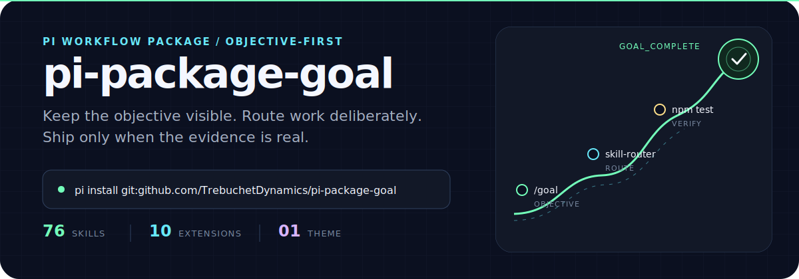
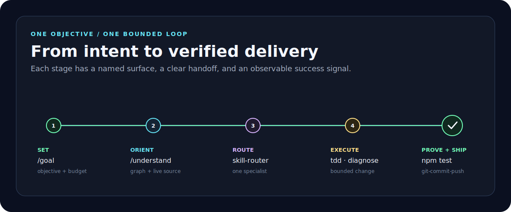

<p align="center">
  
</p>

<p align="center">
  <a href="#quick-start">Quick start</a> ·
  <a href="#choose-a-workflow">Choose a workflow</a> ·
  <a href="#what-ships">What ships</a> ·
  <a href="#development">Development</a>
</p>

`pi-package-goal` is a curated [Pi](https://pi.dev) package for disciplined agent work. It combines persistent objectives, specialist skills, codebase understanding, guarded refactors, research, UI craft, and evidence-backed delivery in one install.

## Quick start

Requires Pi and Node.js `>=22`.

```bash
pi install git:github.com/TrebuchetDynamics/pi-package-goal
```

Reload an open Pi session, then start with a real objective:

```text
/reload
/goal improve this repository until npm test passes and the README is clear
```

Useful smoke checks:

```text
/goal status
/ponytail status
```

Install for only the current project/team repository with `-l`:

```bash
pi install -l git:github.com/TrebuchetDynamics/pi-package-goal
```

## The operating loop

<p align="center">
  
</p>

The package does not hide the work behind a universal mega-agent. It keeps five responsibilities explicit:

1. **Set the objective** — `/goal` keeps scope and token budget visible.
2. **Orient from evidence** — `/understand` maps the codebase; live files remain authoritative.
3. **Route deliberately** — `skill-router` chooses one primary workflow.
4. **Execute a bounded slice** — `tdd`, `diagnose`, UI skills, refactor skills, or another specialist owns the change.
5. **Prove the result** — tests and `git-commit-push` provide the delivery receipt.

## Choose a workflow

| You want to… | Start here | Success signal |
| --- | --- | --- |
| Keep a long task on course | `/goal <objective>` | Objective completed with evidence |
| Find useful repository work | `autonomous-codebase-improver` | One validated bounded slice |
| Diagnose a concrete failure | `diagnose` | Repro fails before and passes after |
| Build behavior test-first | `tdd` | Red → green → refactor |
| Understand architecture | `/understand` | Knowledge graph + agent-readable map |
| Plan a graph-backed refactor | `/understand-refactor <focus>` | Bounded plan grounded in live files |
| Split one noisy folder | `/folder-refactor <folder>` | Every remaining root file classified |
| Audit repository health | `technical-auditor` | Evidence-backed findings and priorities |
| Improve a webpage with curated resources | `ui-vault` | Scored diagnosis + 3–5 traced proposals |
| Build or redesign UI | `ui-design` | Correct specialist + visual/validation evidence |
| Research with provenance | `research-forge` or `/ketch <request>` | Source-backed findings |
| Ship local work | `git-commit-push` | Validated commit and push receipts |
| Use fewer tokens | `/ponytail` or `caveman` | Smaller scope or shorter communication |

Skills load on demand. Invoke them naturally or use `/skill:<name>` when skill commands are enabled:

```text
/skill:diagnose debug the failing parser test
/skill:ui-vault improve src/routes/pricing.tsx
/skill:git-commit-push ship the validated changes
```

## What ships

| Surface | Included | Purpose |
| --- | ---: | --- |
| Agent skills | **76** | Engineering, planning, delivery, UI, research, Pi, and communication workflows |
| Pi extensions | **10** | Commands, tools, hooks, status behavior, and research bridges |
| Theme | **1** | `trebuchet-neon`, a complete dark Pi token map |
| Package bins | **2** | `tx` and `autofolderrefactor` |
| Runtime dependencies | **0** | Pi core packages remain optional peers |

### Core extension surfaces

| Surface | What it adds |
| --- | --- |
| `/goal` | Persistent objective, budget, pause/resume, status, and completion tools |
| `/goal-technical-auditor` | Autonomous audit → validated slices → re-audit controller |
| `/understand` | Understand-Anything graph, map, compare, explain, onboard, domain, and refactor flows |
| `/folder-refactor` | Deterministic folder scan, state, and completion audit tools |
| `/rtk` | Optional command rewriting and output compaction through an installed RTK binary |
| `/ponytail` | Session-level YAGNI and shortest-safe-diff modes |
| `/ketch` | Web, public-code, documentation, scrape, and crawl research routing |
| `/onklaud` | Advisory Onklaud council while Pi retains mutation ownership |
| `/s3upload` | Dispatch to the separately installed Azure upload workflow |
| Mobile low-redraw | Hides the repainting work timer inside SSH + tmux sessions |

<details>
<summary><strong>Goal controls</strong></summary>

```text
/goal <objective>
/goal --tokens 50k <objective>
/goal status
/goal edit [--tokens 100k] <objective>
/goal pause
/goal resume
/goal clear
/goal statusbar on|off
```

`/goal-technical-auditor [--tokens 700k] [--dry-run] [--focus bug-hunt-refactor] [folder|prompt]` runs technical-auditor in Full mode, records findings in `docs/audits/`, validates one slice at a time, and re-audits before delivery. Use `status`, `resume`, or `abort` to control it.

</details>

<details>
<summary><strong>Understand commands</strong></summary>

```text
/understand
/understand src/frontend --language zh
/understand dashboard
/understand chat How does auth work?
/understand diff
/understand agent
/understand compare ../project-a ../project-b
/understand refactor "auth flow"
/understand explain src/auth/login.ts
/understand onboard
/understand domain
/understand knowledge ~/path/to/wiki
/understand update
```

Direct aliases include `/understand-dashboard`, `/understand-chat`, `/understand-diff`, `/understand-explain`, `/understand-onboard`, `/understand-domain`, `/understand-knowledge`, `/understand-agent`, `/understand-compare`, and `/understand-refactor`.

Generated `.understand-anything/` data and `codebase-map-understand.md` are orientation aids, not package resources or automatic source-of-truth replacements.

</details>

<details>
<summary><strong>Complete skill inventory</strong></summary>

**Communication (8)**

`caveman`, `ponytail`, `ponytail-audit`, `ponytail-debt`, `ponytail-gain`, `ponytail-help`, `ponytail-review`, `writing-shape`

**Delivery (4)**

`autoreview`, `git-commit-push`, `greploop`, `s3upload`

**Engineering (13)**

`autonomous-codebase-improver`, `bug-harvest`, `candidates-folder-refactor`, `diagnose`, `improve-codebase-architecture`, `prompt-cache-auditor`, `prototype`, `share-code`, `skill-folder-refactor`, `tdd`, `technical-auditor`, `unused-code`, `wiki-docs`

**Frontend and design (22)**

`beautify-github-readme`, `brandkit`, `chrome-extensions`, `design-taste-frontend`, `design-taste-frontend-v1`, `frontend-design`, `full-output-enforcement`, `gpt-taste`, `hallmark`, `high-end-visual-design`, `imagegen-frontend-mobile`, `imagegen-frontend-web`, `image-to-code`, `industrial-brutalist-ui`, `minimalist-ui`, `modern-web-guidance`, `redesign-existing-projects`, `stitch-design-taste`, `stitch-react-components`, `ui-design`, `ui-ux-pro-max`, `ui-vault`

**Pi authoring (3)**

`pi-ecosystem-scout`, `pi-extensions-helper`, `write-a-skill`

**Planning (11)**

`goal`, `grill-me`, `grill-with-docs`, `handoff`, `lgtm`, `nack`, `skill-router`, `to-issues`, `to-prd`, `triage`, `zoom-out`

**Research (1)**

`research-forge`

**Superpowers compatibility (14)**

`brainstorming`, `dispatching-parallel-agents`, `executing-plans`, `finishing-a-development-branch`, `receiving-code-review`, `requesting-code-review`, `subagent-driven-development`, `systematic-debugging`, `test-driven-development`, `using-git-worktrees`, `using-superpowers`, `verification-before-completion`, `writing-plans`, `writing-skills`

</details>

## Optional integrations

The package does not silently install external tools. Use only what your workflow needs.

### OmniRoute for Pi

From a checkout, review and run:

```bash
sh install-omniroute-pi.sh
```

The installer installs OmniRoute globally, starts its local daemon, creates the `pi-auto` free-model fallback through OmniRoute's public API, preserves existing Pi providers/settings, writes permission-restricted backups, and selects the route as Pi's default model.

For an existing server:

```bash
sh install-omniroute-pi.sh --config-only --base-url https://host.example/v1
```

Remote servers must already expose the requested route.

### RTK

Install and review [rtk-ai/rtk](https://github.com/rtk-ai/rtk) separately, then use `/rtk status`. The extension fails open when RTK is absent or unsupported.

```text
/rtk status
/rtk stats
/rtk clear-stats
```

Set `RTK_DISABLED=1` to bypass rewriting and compaction.

### Onklaud

Use `/onklaud explain` before installation. Pi remains responsible for file changes, tests, commits, and pushes; Onklaud is advisory.

```text
/onklaud status
/onklaud --dry-run fix the failing tests
/onklaud install --yes
```

### Global Codex and Claude skill copies

From a checkout:

```bash
sh install-agent-skills.sh
```

This installs flattened skill directories to `~/.agents/skills` and `~/.claude/skills`, backing up same-name skills under `~/.local/state/pi-package-goal/skill-backups/`. Options: `--codex-only`, `--claude-only`, `--dry-run`, and `--no-backup`.

## Theme and shell helpers

### `trebuchet-neon`

Select the bundled theme in `/settings` or set:

```json
{ "theme": "trebuchet-neon" }
```

Its dark navy, green, cyan, magenta, and amber palette is also the source for this README's visual system.

### `tx`

Install the phone-friendly tmux profile from a checkout:

```bash
npm run tmux:install
```

Then use `tx init`, `tx add <alias> [dir]`, and `tx doctor`. See [`tmux/README.md`](tmux/README.md).

### `autofolderrefactor`

```bash
sh install-autofolderrefactor.sh
autofolderrefactor ignore [folder]
autofolderrefactor N [folder]
```

The loop ranks bounded folder candidates, preserves dirty work, runs guarded refactor workflows, validates slices, and cools down landed candidates.

## Safety model

- Package extensions and skills run with your local permissions; review source before installation.
- External tools are opt-in and remain outside the package's runtime dependencies.
- Delivery workflows do not deploy, release, force-push, rebase, or rewrite history without explicit authorization.
- Graphs, councils, catalogs, and reviewer output are evidence inputs—not authority.
- Advisors and reviewers use the [clean-context delegation contract](skills/shared/CLEAN-CONTEXT-DELEGATION.md) when the host supports isolated workers.
- Third-party source, local changes, and license copies are recorded in [`THIRD_PARTY_NOTICES.md`](THIRD_PARTY_NOTICES.md).
- Generated `.pi/` and `.understand-anything/` state is excluded from the package tarball.

## Package shape

```text
extensions/  Pi commands, tools, hooks, and bridges
skills/      Discoverable Agent Skills and bundled references
themes/      Pi TUI themes
tmux/        tx launcher and low-bandwidth tmux profile
licenses/    Preserved third-party license copies
tests/       Manifest, extension, asset, helper, and workflow checks
```

Pi discovers resources through `pi.extensions`, `pi.skills`, and `pi.themes` in `package.json`:

```json
{
  "pi": {
    "extensions": [
      "./extensions/goal",
      "./extensions/goal-technical-auditor",
      "./extensions/understand",
      "./extensions/folder-refactor",
      "./extensions/rtk",
      "./extensions/ponytail",
      "./extensions/ketch",
      "./extensions/onklaud",
      "./extensions/mobile-low-redraw",
      "./extensions/s3upload"
    ],
    "skills": ["./skills"],
    "themes": ["./themes"]
  }
}
```

Pi core imports are optional peer dependencies. The root package intentionally has no runtime dependencies.

## Update or remove

```bash
pi update git:github.com/TrebuchetDynamics/pi-package-goal
pi remove git:github.com/TrebuchetDynamics/pi-package-goal
```

Run `/reload` after either command in an open session.

## Development

Read [`AGENTS.md`](AGENTS.md), then validate changes with:

```bash
npm test
git diff --check
npm pack --dry-run
```

Audit the nested Stitch tool separately when it changes:

```bash
npm --prefix skills/frontend/stitch-react-components audit --omit=dev --audit-level=moderate
```

## License and provenance

Package-local code and documentation are MIT-licensed. Bundled third-party resources retain their own terms; see [`THIRD_PARTY_NOTICES.md`](THIRD_PARTY_NOTICES.md) and [`licenses/`](licenses/).
